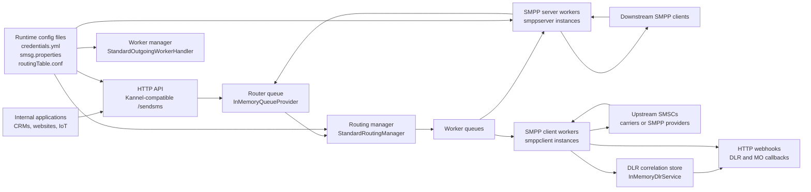
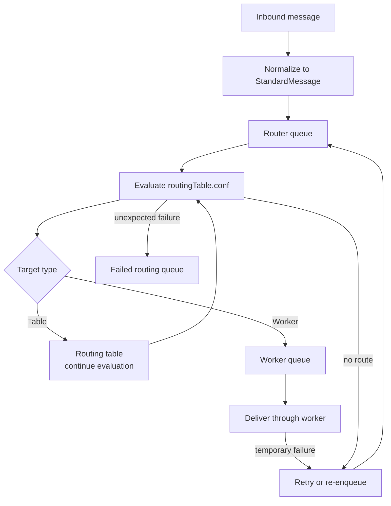
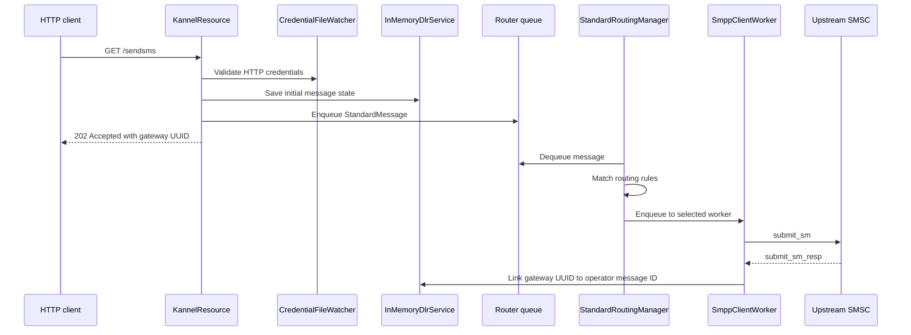
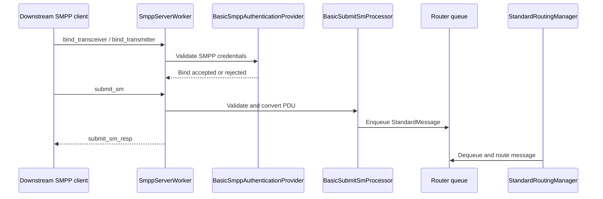
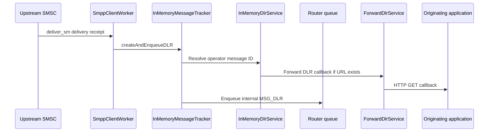
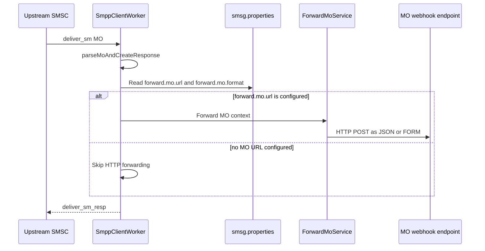

# Architecture Overview

Sendium is a Quarkus-based SMS gateway that accepts outbound messages from HTTP or downstream SMPP clients, normalizes them into internal messages, routes them through configurable routing tables, and delivers them through SMPP client workers to upstream SMSCs or carriers.

The runtime is split into two Maven modules:

| Module | Purpose |
| :--- | :--- |
| `sendium-app` | Runnable Quarkus application, Docker image entry point, application properties, and packaging. |
| `sendium-core` | Gateway implementation: HTTP API, SMPP server/client workers, routing, queues, DLR tracking, configuration support, and webhook forwarding. |

## Runtime Components



## Message Flow

Sendium uses a queue-based pipeline. Inbound protocols create `StandardMessage` instances and enqueue them into the router queue. Router threads evaluate `routingTable.conf` and enqueue the message into one or more selected worker queues. Worker threads then perform the protocol-specific delivery work.



## HTTP Submission Flow

The HTTP API exposes a Kannel-compatible `GET /sendsms` endpoint. `KannelResource` validates HTTP credentials from `credentials.yml`, decodes request parameters into a `StandardMessage`, saves initial DLR state with the callback URL when present, and enqueues the message for routing.



## SMPP Server Flow

SMPP server workers accept binds from downstream SMPP clients. The server validates credentials, applies connection/window limits, converts submitted PDUs into internal messages, and puts them into the same router queue used by HTTP submissions.



## Routing And Workers

`StandardOutgoingWorkerHandler` reads enabled `outSms.instance.*` definitions from configuration and starts the matching worker implementation. `StandardRoutingManager` keeps a routing target map containing configured routing tables and active workers.

| Component | Responsibility |
| :--- | :--- |
| `InMemoryQueueProvider` | Provides the shared router queue and named worker queues. |
| `StandardRoutingManager` | Consumes the router queue and evaluates routing rules from the default routing table. |
| `StandardOutgoingWorkerHandler` | Starts, stops, and tracks configured worker instances. |
| `AbstractOutWorker` | Base worker behavior: queue subscription, thread count, TPS limiting, retry actions, pause/suspend behavior, and filters. |
| `SmppClientWorker` | Sends routed messages to upstream SMSCs through SMPP sessions. |
| `SmppServerWorker` | Accepts downstream SMPP clients and routes inbound submit messages or DLRs. |

## DLR Handling

Outbound HTTP messages can include a Kannel-style `dlr-url`. Sendium stores the gateway message ID and later links it to the operator/SMSC message ID returned by the SMPP provider. When a DLR arrives, the DLR service resolves the correlation and forwards the callback.



## MO Handling

Mobile-originated messages received from upstream SMPP providers are handled by the SMPP client worker. If the worker instance has an MO forwarding URL configured, `SmppClientWorker` forwards the MO through `ForwardMoService` using the configured forwarding format.



MO forwarding is configured per SMPP client worker instance in `smsg.properties`. The implementation lives in `sendium-core/src/main/java/gr/cytech/sendium/core/smpp/client/SmppClientWorker.java`, where `forward.mo.url`, `forward.mo.format`, and `parseMoAndCreateResponse` control the forwarding behavior.

```properties
outSms.instance.testRoute.forward.mo.url = https://example.com/mo
outSms.instance.testRoute.forward.mo.format = JSON
```

`forward.mo.format` supports `JSON` and `FORM`. If the configured value is invalid, Sendium falls back to `JSON`.

## Configuration And Reloading

Sendium expects runtime files in the configured `conf` directory.

| File | Used by | Notes |
| :--- | :--- | :--- |
| `credentials.yml` | HTTP API and SMPP server authentication | Watched and reloaded by `CredentialFileWatcher`. |
| `smsg.properties` | Quarkus and Sendium worker/runtime settings | Defines enabled workers, SMPP binds, logging, queue, retry, and forwarding settings. |
| `routingTable.conf` | Routing manager | Watched and reloaded by `RoutingFileWatcher`. Invalid reloads retain the previous routing state. |

## Persistence Boundaries

Most runtime queues are in-memory. The DLR correlation service uses H2 MVStore at `data/dlr-mvstore.db` by default and falls back to in-memory maps if the store cannot be opened.

This means operators should treat queued, in-flight messages as process-local state, while DLR correlation has lightweight local persistence.

## Related Documentation

* [Documentation Map](DocumentationMap.md)
* [HTTP API](06-http-api.md)
* [SMPP Configuration](04-smpp-configuration.md)
* [Routing Engine](05-routing-engine.md)
* [Webhooks](07-webhooks.md)
* [Docker Deployment](02-docker-deployment.md)
