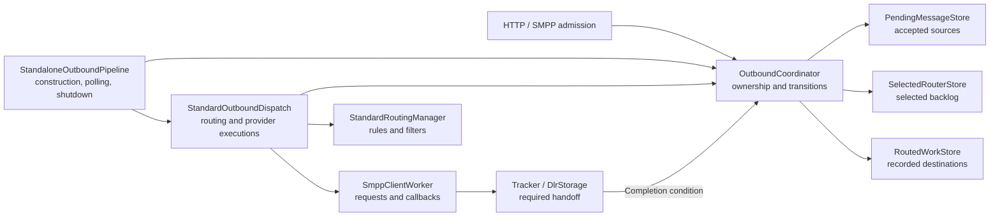
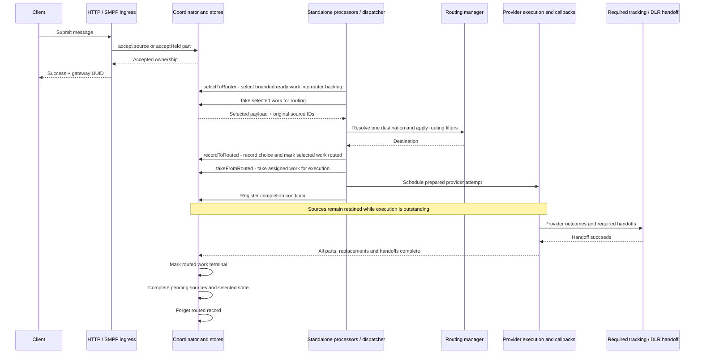
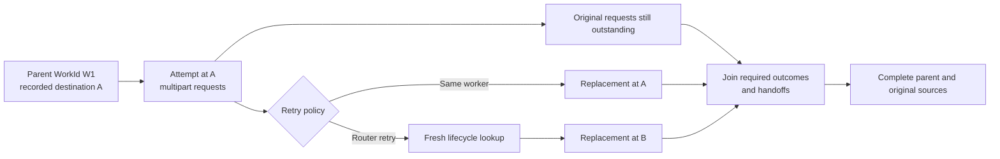
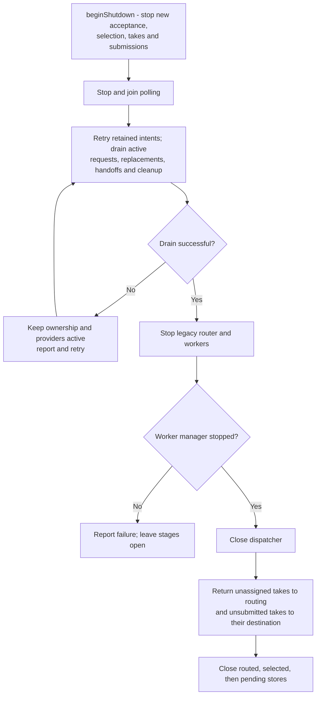

# Outbound Message Storage

Sendium's standalone application processes HTTP/SMPP submissions through one shared outbound lifecycle.
Accepted sources remain owned until provider processing and every required tracking/delivery-report
(DLR) handoff finish. **Acceptance, queue removal and provider submission are not terminal completion.**

Only **`memory/memory/memory`** is implemented: unfinished work is lost on process closure or restart.
The contracts are message-neutral; the current standalone provider adapter executes SMPP-client submissions.
This is the initial slice of [#338](https://github.com/cytechmobile/sendium/issues/338), under [#337](https://github.com/cytechmobile/sendium/issues/337).

## Components

`sendium-core` supplies reusable contracts and implementations. `sendium-app` constructs and runs the
standalone pipeline; importing the core library alone does not activate this storage assembly.

| Component | Responsibility |
|---|---|
| `MessageStorageProfile` / `StandaloneMessageStorage` | Validate startup selectors, produce the profile and report its non-durable guarantee. |
| `StandaloneOutboundPipeline` | Start one shared coordinator; drive bounded selection, routing, dispatch, retries and drain-first shutdown. |
| `KannelResource` / `SmppServerWorker` | Admit before HTTP 202 / SMPP success; retain original source identities through multipart preparation. |
| `PendingMessageStore` / `MemoryPendingMessageStore` | Retain accepted sources, held parts and ready work through source completion. |
| `SelectedRouterStore` / `MemorySelectedRouterStore` | Own bounded selection and unassigned routing work; retain selected bookkeeping after routing. |
| `RoutedWorkStore` / `MemoryRoutedWorkStore` | Record one destination per selection and schedule its unfinished work by destination. |
| `DefaultOutboundCoordinator` / `OutboundWork` | Enforce typed source/selection/work ownership, transitions, handoff-dependent completion and retryable cleanup. |
| `StandardRoutingManager` / `StandardOutboundDispatch` | Resolve rules/filters, retain recording intents and schedule tracked provider attempts. |
| `SmppClientWorker` / `SmppClientSessionHandler` / `CoordinatedSmppSubmission` | Prepare/send requests, process callbacks once and join part/replacement outcomes. |
| `Tracker` / `StandardMessageTracker` | Signal successful required handoff; integrate with the independently configured DLR subsystem. |

## Message Lifecycle

- **Identity:** HTTP/SMPP reuse each gateway UUID as its typed `SourceId`. `SelectionId` and `WorkId`
  identify later steps independently of mutable payloads and provider IDs. Return the actual take handle,
  with its updated payload, rather than a reconstructed wrapper; stale returns must not overwrite live work.
- **Incoming multipart:** `acceptHeld` retains each part before acknowledgement. The existing reassembler
  makes an aggregate or expired individual parts ready using `makeHeldReady(originalSourceIds, payload)`.
  This creates no new admission; publication retries do not re-acknowledge or reassemble the input.
- **Outgoing multipart:** provider requests and replacements share one routed parent and original source
  set. They are not copied-route branches. No source is removed until all required completion conditions succeed.
- **Completion:** `complete(workId, stage)` can register an outstanding condition; it does not immediately
  delete sources. Successful cleanup marks routed work terminal, completes pending sources and selected
  bookkeeping, then forgets routed ownership. Successful steps are remembered for cleanup-only retry.
- **DLR boundary:** completion waits for required handoff acceptance, not a later handset-delivery receipt.
  Receipt storage/delivery remains independent of outbound backend selection.

`StandardOutboundDispatch.routeSelected()` performs routing lookup and filters.
`OutboundCoordinator.recordToRouted(selected, destination)` records that already-chosen result and
advances stage ownership; it does not choose the destination or send the message.
`takeFromRouted(destination, timeout)` takes one assigned item without completing ownership;
`returnToRouted(work)` returns an unfinished take to scheduling at its unchanged destination.
`makeHeldReady(sources, preparedMessage)` binds held sources to the caller-prepared payload without
assembling or accepting new input. `selectToRouter(limit)` then selects eligible work into the router
backlog and returns the newly staged count; it does not evaluate routing rules.

## Ownership and Capacity

The stores are process-local objects, not three independent batches. The routed store contains queues
for recorded destinations; it is **not** the worker's legacy `msgQ` or a disk directory.

For three groups of 100 distinct, unfinished, single-source messages:

| Location in the flow | Pending source records | Selected records | Routed records |
|---|---:|---:|---:|
| 100 ready, not selected | 100 | 0 | 0 |
| 100 selected, not assigned | 100 | 100 | 0 |
| 100 assigned, queued or executing | 100 | 100 retained as bookkeeping | 100 |
| Total logical ownership | **300** | **200** | **100** |

Only the unassigned group occupies router queue capacity. Recording a destination frees its routing
slot but retains the selected record until cleanup. These counts are not physical payload-copy or RAM counts.

| Setting | Default | Meaning |
|---|---:|---|
| `sendium.message.pending.capacity` | 10000 | All retained accepted sources, including held parts and sources executing at later stages. |
| `sendium.message.router-queue.capacity` | 1000 | Queued plus taken unassigned selections; taking does not free a slot. |
| `sendium.message.selection-batch-size` | 100 | Maximum new selections, routing takes and takes for each eligible destination per processing cycle. |
| Routed capacity | Same as pending capacity | Retained destination records across all workers, including terminal records awaiting cleanup; no separate setting. |

With 950 occupied router slots, capacity 1000 and batch size 100, at most **50** new selections fit.
A group of N accepted multipart sources uses N pending slots but one selected slot and one routed record.
Partial terminal cleanup can retain routed records after source removal, so equal capacities do not
eliminate cleanup-related backpressure or provide cross-store transactions.

The poller has a 100-millisecond fixed delay after each cycle. Batch size is not TPS or provider
concurrency: attempts use the worker's shared rate limiter and a dispatcher-owned execution pool
sized by its `threadCount`. A sending slot is reserved before executor submission, bounding queued
plus executing preparation tasks. The default shared two-thread scheduler handles destination
resolution and timed retries; rate waits, worker filters, and SMPP sends run on the worker's pool.
Stopped-worker pools are retired during transition maintenance, and dispatcher close shuts down
its worker pools after provider drain even when the timer scheduler is application-owned.
Awaiting asynchronous outcomes does not hold a sending slot. Count limits do not bound message bytes.

## Retries and Failures

The parent keeps its **initial destination**, while runtime attempts carry their actual destinations.
Router retries resolve routing again without new admissions or a parent transfer. Existing full-message
versus individual-part retry choices are preserved. Attempt progress is non-durable; this is not exactly-once delivery.
`requeueForRouting` puts taken unassigned selections back in the selected backlog.
`returnToRouted` preserves the assigned destination. Provider router retries are separate runtime
attempts, not either storage-return operation.

| Boundary | Behavior |
|---|---|
| Unsupported backend profile | Fail startup with requested/supported choices; no fallback to memory. |
| Admission capacity/unavailability | HTTP 503; SMPP capacity returns `STATUS_THROTTLED`. Failed admission is not acknowledged as success. |
| Routing miss / nonterminal lookup failure | Use `requeueForRouting` with ownership retained. A terminal routing drop uses `discard`. |
| Copied route / unsupported standalone destination | Reject before assignment, even if a copied rule resolves to one target. The existing legacy copied-routing API remains separate. |
| Destination-recording failure | Retry the retained original intent without repeating lookup or routing filters. |
| Required handoff failure | Retain ownership and retry the handoff, not an accepted provider request. |
| Terminal cleanup failure | Retry unfinished cleanup without awaiting another successful handoff or redispatching provider work. |

Each provider response is claimed once; duplicate callbacks cannot create another replacement or
complete unrelated sources. Admission deduplication applies while ownership is retained, not forever.
Runtime worker removal's legacy queue return does not migrate coordinator-owned parent records.

## Graceful Shutdown

Providers, callbacks and replacement scheduling stay active during drain. Standalone shutdown has no
forced drain cutoff; unresolved work keeps it waiting and logging. Stop failure or refused closure is
not terminal success. Application-owned schedulers are not closed by the dispatcher.

`beginShutdown()` starts this process by stopping new lifecycle work; it does not itself drain providers,
stop workers or close stores. The application performs those steps before `close()`.

Execution becomes active when `submitToProvider` registers its scheduled attempt, even before the first
network send. These attempts must drain. Queued routed work not handed to that boundary keeps its chosen
destination; shutdown does not submit the entire pending/selected/destination backlog merely to empty it.

For the 100-message groups above, ready work stays pending, unassigned takes return to routing, and
unsubmitted work stays at its destination. Started executions complete normally before closure.
**Memory close clears remaining unfinished records. There is no shutdown-time switch to disk storage.**

## Configuration and Restart Guarantees

All selectors and bounds are global, startup-only Quarkus configuration. See the
[configuration reference](09-configuration-reference.md#outbound-message-storage-profile) for defaults,
environment variables and overrides. Selectors default to `memory`; blank, unknown or unimplemented
values fail. Capacity/batch values must be positive.

`StandaloneMessageStorage` validates before watcher/worker startup and reports the non-durable profile.
`StandaloneOutboundPipeline` separately starts the shared coordinator and activates polling after
existing router/worker startup. A failing coordinated admission never falls back to a legacy queue.

| Pending / selected / routed | Availability | Restart behavior |
|---|---|---|
| `memory/memory/memory` | Implemented and activated; default | No recovery across closure/restart. |
| `file/memory/memory` | Future [#339](https://github.com/cytechmobile/sendium/issues/339) | Recover sources; reselect and reroute. |
| `file/file/memory` | Future [#345](https://github.com/cytechmobile/sendium/issues/345) | Recover selected work; reroute. |
| `file/memory/file` | Future #345 | Reselect not-yet-routed sources; restore recorded destinations. |
| `file/file/file` | Future #345 | Restore selected work and recorded destinations. |
| PostgreSQL profiles | Future [#333](https://github.com/cytechmobile/sendium/issues/333) | Only explicitly implemented combinations. |

Future profiles are not selectable today. Memory remains the non-durable default; planned file profiles
are opt-in. Durable recovery must reconcile identities and resume the latest recorded stage without
scheduling earlier retained records independently. It requires surviving storage and remains at least
once: provider submission before recorded completion may repeat. Physical backends, codecs and durable
provider-outcome checkpoints belong to subsequent issues.

## Embedding and API Reference

Embedding applications supply compatible `M extends StandardMessage` stores, selection/preparation,
snapshot policy, tracking handoffs and lifecycle orchestration. Constructors are passive; the default
coordinator requires fresh non-durable stages and does not implement durable startup recovery.

Custom subtype fields and runtime mutations must survive transitions/returns without changing retained
earlier-stage payloads. `StandaloneMessageSnapshot` handles standard protocol payloads and supported
mutable fields; custom types require an application-owned mapper/assembly. Shared message naming leaves
room for future OTT integrations without claiming current Viber/WhatsApp execution support.

Detailed operation, idempotence and failure rules are defined in the tracked Java contracts:

- [OutboundCoordinator](../sendium-core/src/main/java/gr/cytech/sendium/core/outbound/OutboundCoordinator.java) and [OutboundWork](../sendium-core/src/main/java/gr/cytech/sendium/core/outbound/OutboundWork.java)
- [PendingMessageStore](../sendium-core/src/main/java/gr/cytech/sendium/core/storage/PendingMessageStore.java)
- [SelectedRouterStore](../sendium-core/src/main/java/gr/cytech/sendium/core/storage/SelectedRouterStore.java)
- [RoutedWorkStore](../sendium-core/src/main/java/gr/cytech/sendium/core/storage/RoutedWorkStore.java)
- [OutboundStage](../sendium-core/src/main/java/gr/cytech/sendium/core/storage/OutboundStage.java) and [OutboundStorageException](../sendium-core/src/main/java/gr/cytech/sendium/core/storage/OutboundStorageException.java)

Verification covers real HTTP/CDI admission, SMPP acknowledgement/reassembly, multipart callbacks,
rerouting and failed handoffs while shutting down, custom-message isolation and application-owned lifecycle,
shutdown ordering and startup rejection. Provider transport/handoffs use controlled fixtures, not a live
external provider. Key tests are [StandaloneOutboundPipelineTest](../sendium-app/src/test/java/gr/cytech/sendium/app/storage/StandaloneOutboundPipelineTest.java),
[SmppClientWorkerTest](../sendium-core/src/test/java/gr/cytech/sendium/core/smpp/client/SmppClientWorkerTest.java) and
[OutboundEmbeddedLifecycleTest](../sendium-core/src/test/java/gr/cytech/sendium/core/outbound/consumer/OutboundEmbeddedLifecycleTest.java).
